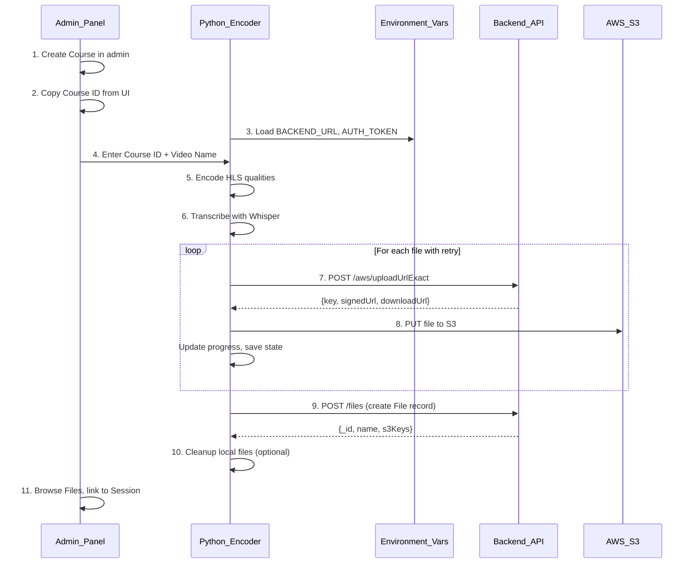

# S3 Upload Integration (Complete Plan)

## Architecture Overview



## Workflow

1. **Admin creates course** in admin panel
2. **Admin copies Course ID** (24-char MongoDB ObjectId)
3. **Admin runs Python encoder** with Course ID + Video Name
4. **Encoder processes** video (HLS + transcripts)
5. **Encoder uploads** to `courses/{courseId}/{language}/{video_name}/` (each video in its own folder; `video_name` sanitized for S3)
6. **Encoder creates File record** in backend
7. **Admin links file** to session via file picker modal

## File Changes Summary

| File               | Change                                         |
| ------------------ | ---------------------------------------------- |
| `requirements.txt` | Add `requests>=2.28.0`, `python-dotenv>=1.0.0` |
| `.env.example`     | New - environment variables template           |
| `config.py`        | New - configuration loader class               |
| `s3_uploader.py`   | New - S3 upload manager with retry logic       |
| `hls_converter.py` | Modify - add S3 panel, upload phase, progress  |
| `s3_config.json`   | New - persisted non-sensitive settings         |

---

## 1. Dependencies - [requirements.txt](requirements.txt)

```
requests>=2.28.0
python-dotenv>=1.0.0
```

## 2. Environment Variables - [.env.example](.env.example)

```bash
# Required
BACKEND_URL=https://api.example.com
AUTH_TOKEN=your_jwt_token_here

# Defaults
DEFAULT_LANGUAGE=en

# Endpoints (match backend routes)
PRESIGN_EXACT_ENDPOINT=/api/v1/admin/content/aws/uploadUrlExact
FILE_CREATE_ENDPOINT=/api/v1/admin/content/files
AUTH_VALIDATE_ENDPOINT=/api/v1/admin/auth/me
```

## 3. Configuration - [config.py](config.py)

```python
import os
from dotenv import load_dotenv
load_dotenv()

class Config:
    BACKEND_URL = os.getenv("BACKEND_URL", "")
    AUTH_TOKEN = os.getenv("AUTH_TOKEN", "")
    DEFAULT_LANGUAGE = os.getenv("DEFAULT_LANGUAGE", "en")
    PRESIGN_EXACT_ENDPOINT = os.getenv("PRESIGN_EXACT_ENDPOINT", "/api/v1/admin/content/aws/uploadUrlExact")
    FILE_CREATE_ENDPOINT = os.getenv("FILE_CREATE_ENDPOINT", "/api/v1/admin/content/files")
    AUTH_VALIDATE_ENDPOINT = os.getenv("AUTH_VALIDATE_ENDPOINT", "/api/v1/admin/auth/me")
    SUPPORTED_LANGUAGES = ["en", "es", "fr", "de", "ar", "hi"]

    @classmethod
    def is_configured(cls) -> bool:
        return bool(cls.BACKEND_URL and cls.AUTH_TOKEN)

    @classmethod
    def get_full_url(cls, endpoint: str) -> str:
        return f"{cls.BACKEND_URL.rstrip('/')}{endpoint}"
```

## 4. S3 Upload Manager - [s3_uploader.py](s3_uploader.py)

Key methods:

- `validate_connection()` - Test backend reachability and token validity
- `get_presigned_url_exact(s3_key, content_type)` - POST to uploadUrlExact endpoint
- `upload_file(local_path, signed_url, progress_callback)` - PUT to S3 with progress
- `upload_directory(local_dir, s3_prefix, cancel_check)` - Upload all files with retry
- `create_file_record(name, course_id, language, s3_keys, duration, qualities)` - POST to files endpoint
- `save_upload_state()` / `load_upload_state()` - Resume capability

Content-Type mapping:

```python
CONTENT_TYPES = {
    ".m3u8": "application/vnd.apple.mpegurl",
    ".ts": "video/mp2t",
    ".srt": "text/plain; charset=utf-8",
    ".txt": "text/plain; charset=utf-8",
    ".json": "application/json",
    ".vtt": "text/vtt",
}
```

Retry logic: 3 attempts with exponential backoff (1s, 3s, 10s).

## 5. UI Changes - [hls_converter.py](hls_converter.py)

### New S3 Upload Panel

```
┌─────────────────────────────────────────────────────┐
│ S3 UPLOAD                                           │
├─────────────────────────────────────────────────────┤
│ [x] Enable S3 Upload                                │
│                                                     │
│ Backend:     ✓ Configured from .env                │
│              (or input fields if not configured)    │
│                                                     │
│ Course ID:   [abc123def456abc123def456     ]       │
│              (Copy from admin panel)                │
│                                                     │
│ Video Name:  [Session 1 - Introduction     ]       │
│              (Display name; S3 folder = sanitized)  │
│                                                     │
│ Language:    [en ▾]                                │
│                                                     │
│ S3 Prefix:   courses/abc123.../en/session_1_.../   │
│              (auto: courseId + lang + video_name)   │
│                                                     │
│ [ ] Delete local files after upload                │
│                                                     │
│ [Test Connection]  [Cancel Upload]                  │
└─────────────────────────────────────────────────────┘
```

### Validation Rules

- **Course ID**: Required, 24 hex chars (MongoDB ObjectId format)
- **Video Name**: Required, max 200 chars (display name). For S3, use a **sanitized** value (same pattern for every course upload): no spaces → underscores, strip invalid path chars, so the S3 segment is consistent (e.g. `session_1_intro` or `module_4_lesson_7_(720p)_hls`). Reuse encoder’s `sanitize_folder_name()` for the S3 folder segment.
- **Language**: Required, from `Config.SUPPORTED_LANGUAGES`

### New Progress Row

```
│ Upload     [████████░░░░░░░░░░░░░░░░] 35%          │
│            Uploading 12/34 (720p/seg_005.ts)       │
```

### Worker Flow Update

```
Phase 1: HLS Encoding (0% -> 55%)
Phase 2: Transcription (55% -> 75%) [if enabled]
Phase 3: S3 Upload (75% -> 95%) [if enabled]
  - S3 prefix: courses/{courseId}/{language}/{video_name}/
    (video_name = sanitized folder name; same pattern for every course upload)
  - For each file: POST /aws/uploadUrlExact with exact key, then PUT to S3
  - Save state periodically for resume
Phase 4: Create File Record (95% -> 98%)
  - POST /api/v1/admin/content/files (s3Keys use same prefix)
Phase 5: Complete (98% -> 100%)
  - Delete local files if checkbox enabled
```

---

## S3 Path Pattern (Required)

**Pattern:** `courses/{courseId}/{lang_code}/{video_name}/`

- **courseId** – MongoDB ObjectId from admin.
- **lang_code** – e.g. `en`, `es` (must match supported languages).
- **video_name** – **One folder per video** so multiple sessions don’t overwrite each other. Must use a **consistent pattern** for every course upload: sanitized (no spaces → underscores; no invalid path chars). Encoder should use the same `sanitize_folder_name()` used for local output so S3 keys match encoder output names (e.g. `module_4_lesson_7_(720p)_hls`).

Backend `GET /files/folder-path/:courseId` returns `courses/{courseId}/{language}/`; the encoder **appends** `{video_name}/` to get the full prefix.

## S3 Key Structure

```
courses/{courseId}/{lang_code}/{video_name}/
├── master.m3u8
├── subtitle_en.m3u8
├── 1080p/
│   ├── index.m3u8
│   └── seg_001.ts, seg_002.ts, ...
├── 720p/
│   └── ...
├── 480p/
│   └── ...
├── {base_name}_transcript.srt
├── {base_name}_transcript.vtt
├── {base_name}_transcript.txt
└── {base_name}_transcript.json
```

(`{base_name}` = encoder output base, e.g. sanitized source filename.)

---

## Backend API Endpoints

### 1. Exact-Key Presigned URL (uploadUrlExact)

The existing pre-signed APIs (`GET /common/aws/upload-url` and `GET /admin/content/aws/uploadUrl/:fileName`) build keys with a **timestamp** and **sanitized** filename, so they cannot produce stable paths like `courses/.../video_name/master.m3u8`. The encoder needs **exact keys** for HLS (stable references) and for `File.s3Keys`. Therefore a **new endpoint** that accepts a full S3 key and optional contentType is required.

- **Endpoint**: `POST /api/v1/admin/content/aws/uploadUrlExact`
- **Headers**: `Authorization: Bearer {token}`, `Content-Type: application/json`
- **Body**: `{"key": "courses/abc123/en/session_1_intro/master.m3u8", "contentType": "application/vnd.apple.mpegurl"}` (key must follow path pattern `courses/{courseId}/{lang_code}/{video_name}/...`)
- **Response**: `{success: true, code: 200, data: {key, signedUrl, downloadUrl}}`

### 2. Create File Record

- **Endpoint**: `POST /api/v1/admin/content/files`
- **Body**:

```json
{
  "name": "Session 1 - Introduction",
  "courseId": "abc123def456abc123def456",
  "language": "en",
  "type": "hls",
  "s3Keys": {
    "master": "courses/abc123.../en/session_1_intro/master.m3u8",
    "qualities": {
      "1080p": "courses/.../en/session_1_intro/720p/...",
      "720p": "...",
      "480p": "..."
    },
    "transcript": { "srt": "...", "vtt": "...", "txt": "...", "json": "..." }
  },
  "duration": 1245,
  "qualities": ["1080p", "720p", "480p"],
  "uploadedBy": "python-encoder"
}
```

### 3. Validate Token (Test Connection)

- **Endpoint**: `GET /api/v1/admin/auth/me`
- **Headers**: `Authorization: Bearer {token}`
- **Response**: 200 = valid, 401 = invalid

---

## Error Handling

- **Retry Logic**: 3 attempts with 1s, 3s, 10s backoff
- **Auth Errors (401/403)**: No retry, show "token expired" message
- **Network Errors**: Retry, save state for resume
- **Partial Failure**: Continue uploading, report failed files at end
- **Resume**: State saved to `.upload_state.json`, prompt to resume on restart

## Config Persistence - [s3_config.json](s3_config.json)

Non-sensitive settings only (credentials stay in `.env`):

```json
{
  "last_course_id": "",
  "last_video_name": "",
  "language": "en",
  "delete_local_after_upload": false
}
```

## Security

- `.env` contains secrets, add to `.gitignore`
- Validate Course ID format before API calls
- HTTPS required for backend URL (except localhost)

---

## Dependencies (Backend Required)

The backend must implement these routes before Python encoder can upload:

1. `**POST /api/v1/admin/content/aws/uploadUrlExact**` – Presigned URL for an **exact** S3 key (no timestamp/sanitization). Existing `generatePreSignedUploadUrl` in AWS service always appends a timestamp to the key; the backend needs a new handler (e.g. `generatePreSignedUploadUrlExact(key, contentType)`) that returns a presigned PUT URL for the given key. See [02-backend-implementation.md](docs/file-folder-system/02-backend-implementation.md).
2. `**POST /api/v1/admin/content/files**` – Create File record after upload. Keys in `s3Keys` must follow `courses/{courseId}/{lang_code}/{video_name}/...`. See [02-backend-implementation.md](docs/file-folder-system/02-backend-implementation.md).

## Related Documentation

- [docs/file-folder-system/01-overview.md](docs/file-folder-system/01-overview.md) - System architecture
- [docs/file-folder-system/02-backend-implementation.md](docs/file-folder-system/02-backend-implementation.md) - Backend routes and models
- [docs/file-folder-system/03-admin-panel-implementation.md](docs/file-folder-system/03-admin-panel-implementation.md) - Admin panel file picker
- [docs/file-folder-system/04-python-encoder-integration.md](docs/file-folder-system/04-python-encoder-integration.md) - Detailed Python code
- [docs/file-folder-system/05-api-specification.md](docs/file-folder-system/05-api-specification.md) - Full API reference
