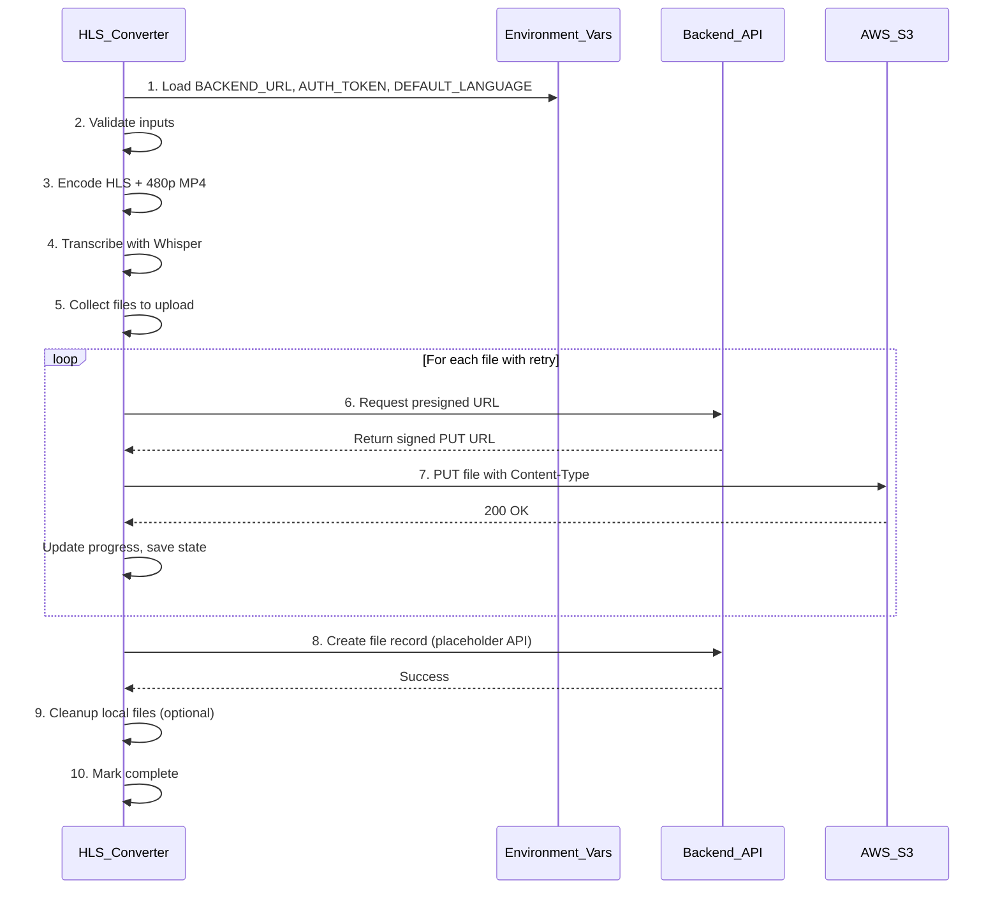

# S3 Upload Integration Plan

## Architecture Overview



## Key Design Decisions

1. **Environment Variables** - Sensitive config (backend URL, auth token) loaded from `.env` file
2. **Placeholder Backend API** - File record creation is stubbed out; you'll define the schema later
3. **Session ID Optional** - Kept for future use when linking files to sessions
4. **Upload-First Approach** - Files are uploaded to S3 first; backend record creation is secondary


## File Changes

### 1. [requirements.txt](requirements.txt) - Dependencies

Add:

```
requests>=2.28.0
python-dotenv>=1.0.0
```

(No boto3 needed since we use presigned URLs via HTTP)

### 2. New file: [.env.example](.env.example) - Environment Variables Template

```bash
# Backend API Configuration
BACKEND_URL=https://api.example.com
AUTH_TOKEN=your_jwt_token_here

# Default Settings
DEFAULT_LANGUAGE=en

# Optional: Auth validation endpoint (for Test Connection)
AUTH_VALIDATE_ENDPOINT=/api/admin/auth/me

# Optional: Presigned URL endpoint
PRESIGN_ENDPOINT=/api/admin/content/aws/uploadUrl

# Optional: File record endpoint (placeholder - update when backend is ready)
FILE_RECORD_ENDPOINT=/api/admin/files
```

### 3. New file: [config.py](config.py) - Configuration Loader

```python
import os
from dotenv import load_dotenv
from typing import Optional

# Load .env file if it exists
load_dotenv()

class Config:
    """Application configuration loaded from environment variables."""
    
    # Required
    BACKEND_URL: str = os.getenv("BACKEND_URL", "")
    AUTH_TOKEN: str = os.getenv("AUTH_TOKEN", "")
    
    # Defaults
    DEFAULT_LANGUAGE: str = os.getenv("DEFAULT_LANGUAGE", "en")
    
    # Endpoints (with sensible defaults)
    AUTH_VALIDATE_ENDPOINT: str = os.getenv("AUTH_VALIDATE_ENDPOINT", "/api/admin/auth/me")
    PRESIGN_ENDPOINT: str = os.getenv("PRESIGN_ENDPOINT", "/api/admin/content/aws/uploadUrl")
    FILE_RECORD_ENDPOINT: str = os.getenv("FILE_RECORD_ENDPOINT", "/api/admin/files")
    
    # Supported languages
    SUPPORTED_LANGUAGES: list = os.getenv("SUPPORTED_LANGUAGES", "en,es,fr,de,ar,hi").split(",")
    
    @classmethod
    def is_configured(cls) -> bool:
        """Check if required env vars are set."""
        return bool(cls.BACKEND_URL and cls.AUTH_TOKEN)
    
    @classmethod
    def get_full_url(cls, endpoint: str) -> str:
        """Build full URL from base + endpoint."""
        return f"{cls.BACKEND_URL.rstrip('/')}{endpoint}"
```

### 4. New file: [s3_uploader.py](s3_uploader.py) - S3 Upload Manager

Separate module for cleaner code organization:

```python
import os
import json
import time
import requests
from typing import Tuple, Dict, List, Callable, Optional
from dataclasses import dataclass, asdict
from config import Config

# Content-Type mapping for S3
CONTENT_TYPES = {
    ".m3u8": "application/vnd.apple.mpegurl",
    ".ts": "video/mp2t",
    ".mp4": "video/mp4",
    ".srt": "text/plain; charset=utf-8",
    ".txt": "text/plain; charset=utf-8",
    ".json": "application/json",
    ".vtt": "text/vtt",
}

@dataclass
class UploadState:
    """Track upload progress for resume capability."""
    total_files: int
    uploaded_files: List[str]
    failed_files: List[str]
    current_file: Optional[str]
    s3_prefix: str
    
class S3UploadManager:
    """Handles all S3 upload operations via backend presigned URLs."""
    
    def __init__(self, session_id: Optional[str] = None, language: str = None):
        """Initialize with config from environment variables.
        
        Args:
            session_id: Optional session ID for future use
            language: Language code (defaults to Config.DEFAULT_LANGUAGE)
        """
        self.backend_url = Config.BACKEND_URL.rstrip("/")
        self.auth_token = Config.AUTH_TOKEN
        self.session_id = session_id  # Optional, for future use
        self.language = language or Config.DEFAULT_LANGUAGE
        self.upload_state = None
        
    def _get_headers(self) -> dict:
        """Return auth headers for API requests."""
        return {
            "Authorization": f"Bearer {self.auth_token}",
            "Content-Type": "application/json"
        }
        
    def validate_connection(self) -> Tuple[bool, str]:
        """Verify backend is reachable and token is valid."""
        try:
            url = Config.get_full_url(Config.AUTH_VALIDATE_ENDPOINT)
            resp = requests.get(url, headers=self._get_headers(), timeout=10)
            if resp.status_code == 200:
                return True, ""
            elif resp.status_code == 401:
                return False, "Authentication token is invalid or expired"
            else:
                return False, f"Backend returned status {resp.status_code}"
        except requests.exceptions.ConnectionError:
            return False, "Cannot connect to backend. Check BACKEND_URL."
        except Exception as e:
            return False, str(e)
        
    def get_presigned_url(self, s3_key: str, content_type: str) -> Tuple[bool, str, str]:
        """Request presigned PUT URL from backend.
        Returns: (success, signed_url, error_msg)
        """
        
    def upload_file(self, local_path: str, s3_key: str, 
                    progress_callback: Callable[[int, int], None] = None,
                    max_retries: int = 3) -> Tuple[bool, str]:
        """Upload file to S3 with retry logic.
        Returns: (success, error_msg)
        """
        
    def upload_directory(self, local_dir: str, s3_prefix: str,
                         progress_callback: Callable[[str, int, int, int, int], None] = None,
                         cancel_check: Callable[[], bool] = None) -> Tuple[bool, Dict, str]:
        """Upload entire directory to S3.
        
        Args:
            cancel_check: Callable that returns True if upload should be cancelled
        Returns: (success, uploaded_keys_dict, error_msg)
        """
        
    def create_file_record(self, s3_keys: Dict[str, str], metadata: dict) -> Tuple[bool, str]:
        """Create file record in backend (PLACEHOLDER).
        
        This method is a placeholder. Update the implementation when 
        the backend file system API is ready.
        
        Args:
            s3_keys: Dict of file type -> S3 key (e.g., {"hls": "...", "mp4": "...", "srt": "..."})
            metadata: Additional metadata (name, duration, language, etc.)
        Returns: (success, error_msg)
        """
        # PLACEHOLDER: Log what would be sent
        print(f"[PLACEHOLDER] Would create file record:")
        print(f"  Endpoint: {Config.get_full_url(Config.FILE_RECORD_ENDPOINT)}")
        print(f"  Session ID: {self.session_id or 'None'}")
        print(f"  Language: {self.language}")
        print(f"  S3 Keys: {s3_keys}")
        print(f"  Metadata: {metadata}")
        
        # TODO: Implement actual API call when backend is ready
        # Example structure:
        # payload = {
        #     "name": metadata.get("name"),
        #     "type": "video",
        #     "language": self.language,
        #     "s3Keys": s3_keys,
        #     "parentFolder": metadata.get("folder_id"),
        #     "sessionId": self.session_id,  # Optional
        #     "metadata": metadata
        # }
        # resp = requests.post(url, json=payload, headers=self._get_headers())
        
        return True, ""  # Always succeed for now
        
    def save_upload_state(self, state_file: str):
        """Save upload state for resume capability."""
        
    def load_upload_state(self, state_file: str) -> bool:
        """Load upload state to resume interrupted upload."""
```

### 5. [hls_converter.py](hls_converter.py) - Main application

#### 5.1 Environment Variable Loading

At startup, load configuration from environment:

```python
from config import Config

class RetroHlsApp:
    def __init__(self, root):
        # ... existing init code ...
        
        # Load env config
        self._load_env_config()
        
    def _load_env_config(self):
        """Load configuration from environment variables."""
        self.env_backend_url = Config.BACKEND_URL
        self.env_auth_token = Config.AUTH_TOKEN
        self.env_default_language = Config.DEFAULT_LANGUAGE
        self.env_configured = Config.is_configured()
        
        if not self.env_configured:
            print("Warning: BACKEND_URL and/or AUTH_TOKEN not set in .env file")
            print("S3 upload will require manual configuration")
```

#### 5.2 New UI Elements (in `_build_ui`)

Add an **S3 Upload panel** after the Transcription panel:

- **Enable S3 Upload** checkbox (`self.s3_upload_enabled`)
- **Backend URL** label showing env var status (read-only, shows "From .env" or input field if not set)
- **Auth Token** label showing "Configured" or input field if not set from env
- **Language** dropdown (`self.language_var`) - populated from `Config.SUPPORTED_LANGUAGES`, default from env
- **S3 Destination** text field (`self.s3_destination_var`) - e.g. `videos/course123/lesson01/`
- **Session ID (Optional)** text field (`self.session_id_var`) - for future linking to sessions
- **Create 480p MP4** checkbox (`self.create_offline_mp4_var`, default checked)
- **Delete local after upload** checkbox (`self.delete_local_var`, default unchecked)
- **Test Connection** button - validates backend connection using env vars
- **Cancel Upload** button - stops upload gracefully (hidden until upload starts)

#### 5.3 Input Validation

```python
def _validate_s3_inputs(self) -> Tuple[bool, str]:
    """Validate S3 upload inputs before starting."""
    errors = []
    
    # Check if env vars are configured, otherwise check UI fields
    if not Config.is_configured():
        # Backend URL validation (from UI)
        url = self.backend_url_var.get().strip()
        if not url:
            errors.append("Backend URL is required (or set BACKEND_URL in .env)")
        elif not url.startswith(("http://", "https://")):
            errors.append("Backend URL must start with http:// or https://")
        
        # Auth token validation (from UI)
        token = self.auth_token_var.get().strip()
        if not token:
            errors.append("Auth token is required (or set AUTH_TOKEN in .env)")
        elif len(token) < 20:
            errors.append("Auth token appears invalid (too short)")
    
    # Session ID validation - OPTIONAL (if provided, validate format)
    session_id = self.session_id_var.get().strip()
    if session_id and not re.match(r'^[a-fA-F0-9]{24}$', session_id):
        errors.append("Session ID must be a valid MongoDB ObjectId (24 hex chars)")
    
    # Destination path validation - REQUIRED
    dest = self.s3_destination_var.get().strip()
    if not dest:
        errors.append("S3 destination is required")
    elif dest.startswith("/"):
        errors.append("S3 destination should not start with /")
    elif not dest.endswith("/"):
        errors.append("S3 destination should end with /")
    elif ".." in dest:
        errors.append("S3 destination cannot contain ..")
    
    if errors:
        return False, "\n".join(errors)
    return True, ""
```

#### 3.3 New Progress Row

Add **Upload** progress bar row (like Transcript row):

- Shows: `"Uploading 5/23 files (master.m3u8)..."` during upload
- Shows bytes progress for large files (MP4)

#### 3.4 480p MP4 Creation

After HLS encoding, if `create_offline_mp4_var` is checked:

```python
def _create_offline_mp4(self, input_path: str, output_dir: str, 
                         progress_callback: Callable[[float], None] = None) -> Tuple[bool, str, str]:
    """Create 480p MP4 for offline download.
    Returns: (success, output_path, error_msg)
    """
    base_name = os.path.splitext(os.path.basename(input_path))[0]
    output_path = os.path.join(output_dir, f"{base_name}_offline_480p.mp4")
    
    prof = QUALITY_PROFILES["480p"]
    encoder_key = self._get_current_encoder_key()
    
    cmd = [
        "ffmpeg", "-hide_banner", "-loglevel", "warning",
        "-nostdin", "-stats", "-y",
        "-i", input_path,
        "-vf", f"scale=854:480:force_original_aspect_ratio=decrease,pad=854:480:(ow-iw)/2:(oh-ih)/2",
    ] + build_video_encode_args(encoder_key, prof) + [
        "-c:a", "aac", "-b:a", "128k", "-ac", "2",
        "-movflags", "+faststart",  # Enable fast start for web streaming
        output_path
    ]
    # Run with progress tracking (reuse _render_single_quality pattern)
```

#### 5.5 Modified Worker Flow

Update `_render_worker` to include S3 upload phase:

```
Phase 1: HLS Encoding (0% -> 50%)
  - Encode selected qualities (720p, 480p, etc.)
  - Progress: per-quality bars + overall

Phase 2: Offline MP4 (50% -> 60%) [if enabled]
  - Create standalone 480p MP4
  - Progress: MP4 bar (new) + overall

Phase 3: Transcription (60% -> 75%) [if enabled]
  - Whisper transcription
  - Progress: Transcript bar + overall

Phase 4: S3 Upload (75% -> 95%) [if S3 enabled]
  - Validate inputs (check env vars or UI fields)
  - Test backend connection
  - Collect all files to upload
  - Upload with retry (3 attempts per file)
  - Progress: Upload bar + overall
  - Save state periodically for resume

Phase 5: File Record Creation (95% -> 98%) [PLACEHOLDER]
  - Call create_file_record() with S3 keys
  - Currently logs what would be sent
  - Will create actual record when backend API is ready

Phase 6: Cleanup & Complete (98% -> 100%)
  - Delete local files if checkbox enabled
  - Update history with S3 keys
  - Show success message with uploaded file count
```

### 4. New file: [s3_config.json](s3_config.json) - Persisted Settings

```json
{
  "backend_url": "https://api.example.com",
  "auth_token": "",
  "last_session_id": "",
  "last_destination": "hls/",
  "create_offline_mp4": true,
  "delete_local_after_upload": false
}
```

Note: Auth token storage is optional - user can choose to re-enter each time for security.

## S3 Key Structure

Based on user-entered destination prefix (e.g., `hls/course123/session456/en/`):


| Content           | S3 Key                     | Content-Type                    |
| ----------------- | -------------------------- | ------------------------------- |
| HLS master        | `{prefix}master.m3u8`      | `application/vnd.apple.mpegurl` |
| HLS 720p playlist | `{prefix}720p/index.m3u8`  | `application/vnd.apple.mpegurl` |
| HLS 720p segments | `{prefix}720p/seg_001.ts`  | `video/mp2t`                    |
| HLS 480p playlist | `{prefix}480p/index.m3u8`  | `application/vnd.apple.mpegurl` |
| Offline MP4       | `{prefix}offline_480p.mp4` | `video/mp4`                     |
| Transcript SRT    | `{prefix}transcript.srt`   | `text/plain; charset=utf-8`     |
| Transcript TXT    | `{prefix}transcript.txt`   | `text/plain; charset=utf-8`     |
| Transcript JSON   | `{prefix}transcript.json`  | `application/json`              |
| Subtitle VTT      | `{prefix}subtitles.vtt`    | `text/vtt`                      |


**Important**: Correct Content-Type headers are required for HLS playback to work in browsers.

## Backend API Endpoints

All endpoints are configurable via environment variables.

### 1. Get Presigned Upload URL (Required)

- **Env Var**: `PRESIGN_ENDPOINT` (default: `/api/admin/content/aws/uploadUrl`)
- **Method**: `POST {BACKEND_URL}{PRESIGN_ENDPOINT}`
- **Headers**: `Authorization: Bearer {AUTH_TOKEN}`, `Content-Type: application/json`
- **Request Body**:

```json
{
    "key": "videos/course123/lesson01/master.m3u8",
    "contentType": "application/vnd.apple.mpegurl"
}
```

- **Response** (200 OK):

```json
{
    "key": "videos/course123/lesson01/master.m3u8",
    "signedUrl": "https://s3.amazonaws.com/bucket/...?X-Amz-Signature=...",
    "downloadUrl": "https://cdn.example.com/..."
}
```

### 2. Validate Token (Optional, for Test Connection)

- **Env Var**: `AUTH_VALIDATE_ENDPOINT` (default: `/api/admin/auth/me`)
- **Method**: `GET {BACKEND_URL}{AUTH_VALIDATE_ENDPOINT}`
- **Headers**: `Authorization: Bearer {AUTH_TOKEN}`
- **Response** (200 OK): Any valid response confirms token works

### 3. Create File Record (PLACEHOLDER - Build Later)

- **Env Var**: `FILE_RECORD_ENDPOINT` (default: `/api/admin/files`)
- **Status**: Not implemented yet - you'll build this API when file system is ready

The `create_file_record()` method in `s3_uploader.py` is stubbed out. When your backend is ready, it will call:

```
POST {BACKEND_URL}{FILE_RECORD_ENDPOINT}
```

**Suggested payload structure** (customize as needed):

```json
{
    "name": "Lesson 01 - Introduction",
    "type": "video",
    "language": "en",
    "parentFolder": "folder_id_here",
    "sessionId": "optional_session_id",
    "s3Keys": {
        "hls": "videos/course123/lesson01/master.m3u8",
        "mp4": "videos/course123/lesson01/offline_480p.mp4",
        "transcript": "videos/course123/lesson01/transcript.srt"
    },
    "metadata": {
        "duration": 3600,
        "qualities": ["1080p", "720p", "480p"]
    }
}
```

## UI Layout (S3 Panel)

```
┌─────────────────────────────────────────────────────┐
│ S3 UPLOAD                                           │
├─────────────────────────────────────────────────────┤
│ [x] Enable S3 Upload                                │
│                                                     │
│ Backend:     ✓ Configured from .env                │
│              (https://api.example.com)              │
│                                                     │
│ Language:    [en ▾]  (from SUPPORTED_LANGUAGES)    │
│ Destination: [videos/course123/lesson01/       ]   │
│                                                     │
│ Session ID:  [                            ] (opt)  │
│              For future linking to sessions         │
│                                                     │
│ [x] Create 480p MP4 for offline download           │
│ [ ] Delete local files after upload                │
│                                                     │
│ [Test Connection]  [Cancel Upload]                  │
│                                                     │
│ Tip: Configure BACKEND_URL and AUTH_TOKEN in .env  │
│ Destination is the S3 folder prefix.               │
└─────────────────────────────────────────────────────┘
```

**If .env not configured**, show input fields instead:

```
┌─────────────────────────────────────────────────────┐
│ S3 UPLOAD                                           │
├─────────────────────────────────────────────────────┤
│ [x] Enable S3 Upload                                │
│                                                     │
│ ⚠ Environment not configured. Enter manually:      │
│                                                     │
│ Backend URL: [https://api.example.com          ]   │
│ Auth Token:  [●●●●●●●●●●●●●●●●●●●●●●           ]   │
│                                                     │
│ Language:    [en ▾]                                │
│ Destination: [videos/course123/lesson01/       ]   │
│ Session ID:  [                            ] (opt)  │
│                                                     │
│ [x] Create 480p MP4 for offline download           │
│ [ ] Delete local files after upload                │
│                                                     │
│ [Test Connection]  [Cancel Upload]                  │
│                                                     │
│ Tip: Create a .env file to avoid re-entering.      │
└─────────────────────────────────────────────────────┘
```

## Progress Panel Update

Add "480p MP4" and "Upload" rows after Transcript:

```
┌─────────────────────────────────────────────────────┐
│ PROGRESS                                            │
├─────────────────────────────────────────────────────┤
│ Overall    [████████████████░░░░░░░░] 72%          │
│ 1080p      [████████████████████████] 100%         │
│ 720p       [████████████████████████] 100%         │
│ 480p       [████████████████████████] 100%         │
│ 480p MP4   [████████████████████████] 100%  <-- NEW│
│ Transcript [████████████████████████] 100%         │
│ Upload     [████████░░░░░░░░░░░░░░░░] 35%   <-- NEW│
│            Uploading 12/34 (720p/seg_005.ts)       │
└─────────────────────────────────────────────────────┘
```

### Upload Progress Details

For the Upload progress bar, show contextual status text:

- `"Validating..."` - during pre-flight checks
- `"Uploading 5/23 files (master.m3u8)"` - during individual file uploads
- `"Uploading 480p.mp4 (45 MB / 120 MB)"` - for large files, show bytes
- `"Updating session..."` - during backend update
- `"Upload complete!"` - on success
- `"Upload failed (3 files). Check logs."` - on partial failure

## Error Handling Strategy

### 1. Pre-flight Validation

- Validate all inputs before starting any processing
- Test backend connection and auth token validity before encoding begins
- Show clear, actionable error messages

### 2. Upload Retry Logic

```python
MAX_RETRIES = 3
RETRY_DELAYS = [1, 3, 10]  # seconds - exponential backoff

def upload_with_retry(self, local_path: str, s3_key: str) -> Tuple[bool, str]:
    for attempt in range(MAX_RETRIES):
        success, error = self._do_upload(local_path, s3_key)
        if success:
            return True, ""
        
        # Check if error is retryable
        if "401" in error or "403" in error:  # Auth errors - don't retry
            return False, f"Authentication failed: {error}"
        if "404" in error:  # Endpoint not found - don't retry
            return False, f"API endpoint not found: {error}"
        
        if attempt < MAX_RETRIES - 1:
            time.sleep(RETRY_DELAYS[attempt])
    
    return False, f"Failed after {MAX_RETRIES} attempts: {error}"
```

### 3. Upload State Tracking (Resume Capability)

```python
# State file saved in output directory: .upload_state.json
{
    "started_at": "2026-02-02T10:30:00Z",
    "backend_url": "https://api.example.com",
    "session_id": "abc123...",
    "s3_prefix": "hls/course123/session456/en/",
    "files": {
        "master.m3u8": {"status": "uploaded", "s3_key": "hls/.../master.m3u8"},
        "720p/index.m3u8": {"status": "uploaded", "s3_key": "hls/.../720p/index.m3u8"},
        "720p/seg_001.ts": {"status": "pending"},
        "720p/seg_002.ts": {"status": "failed", "error": "timeout"}
    }
}
```

If app is restarted and user clicks "Start" on same file with same settings:

1. Detect existing state file
2. Prompt: "Previous upload incomplete. Resume? (12/45 files uploaded)"
3. If yes, skip already-uploaded files
4. If no, start fresh

### 4. Partial Failure Handling


| Scenario                         | Behavior                                                |
| -------------------------------- | ------------------------------------------------------- |
| Single file upload fails 3x      | Mark as failed, continue with others, report at end     |
| >50% files fail                  | Stop upload, show error, keep local files               |
| Presigned URL request fails      | Retry 3x, then fail that file                           |
| Backend session update fails     | Warning only (files are uploaded), prompt manual update |
| Network disconnect during upload | Save state, allow resume                                |


### 5. User-Facing Error Messages

```python
ERROR_MESSAGES = {
    "auth_expired": "Authentication token expired. Please get a new token from the admin panel.",
    "network_error": "Network error. Check your internet connection and try again.",
    "backend_unreachable": "Cannot connect to backend API. Verify the URL is correct.",
    "invalid_session": "Session ID not found. Verify the session exists in the admin panel.",
    "quota_exceeded": "S3 storage quota exceeded. Contact administrator.",
    "upload_failed": "Upload failed for {count} files. Check logs for details.",
}
```

### 6. Logging

Create detailed log file for troubleshooting:

```
upload_log_2026-02-02_103000.txt
```

Contains:

- All API requests/responses (sanitized - no tokens)
- Upload progress per file
- Errors with stack traces
- Timing information

## Security Considerations

### Environment Variable Security

- **Auth token in .env file**: Keep `.env` out of version control (add to `.gitignore`)
- **Fallback UI fields**: If env vars not set, show masked password field for manual entry
- **Token validation**: Validate token format before use
- **HTTPS only**: Reject backend URLs that don't use HTTPS (except localhost for dev)

### Input Sanitization

- S3 destination: disallow `..`, absolute paths, special characters
- Session ID: validate MongoDB ObjectId format (if provided)
- Backend URL: validate scheme, no path traversal

### .gitignore Additions

```gitignore
# Environment variables (contains secrets)
.env
.env.local
.env.*.local

# Upload state files
.upload_state.json

# Local config (may contain preferences)
s3_config.json
```

## Configuration Persistence

Save non-sensitive settings to `s3_config.json`:

```python
class S3ConfigManager:
    CONFIG_FILE = "s3_config.json"
    
    def load(self) -> dict:
        """Load config, return defaults if not found."""
        defaults = {
            # Note: backend_url and auth_token come from .env, not saved here
            "last_destination": "videos/",
            "last_session_id": "",  # Optional, for future use
            "create_offline_mp4": True,
            "delete_local_after_upload": False,
        }
        # Load and merge with defaults
        
    def save(self, config: dict):
        """Save non-sensitive config only."""
        # Only save UI preferences, not credentials
        safe_config = {
            "last_destination": config.get("last_destination", "videos/"),
            "last_session_id": config.get("last_session_id", ""),
            "create_offline_mp4": config.get("create_offline_mp4", True),
            "delete_local_after_upload": config.get("delete_local_after_upload", False),
        }
        # Write to file
```

**Important**: Sensitive data (backend URL, auth token) is stored in `.env` file, not in `s3_config.json`. Add `.env` to `.gitignore`.

## Additional Robustness Features

### Language Code Configuration

Add a **Language** dropdown/field to specify the language code (default: "en"):

- Used in backend Session update: `hls["en"]`, `video["en"]`, `transcribe["en"]`
- Common values: "en", "es", "fr", "de", "ar", "hi"
- Stored in config for persistence

### Upload Timeouts

```python
# Timeout configuration
CONNECT_TIMEOUT = 10  # seconds - for establishing connection
READ_TIMEOUT = 300    # seconds - for reading response (5 min for large files)

# For .ts segments (~2-5 MB): 30s timeout
# For offline_480p.mp4 (~50-500 MB): 5 min timeout

def get_timeout_for_file(filepath: str) -> int:
    """Return appropriate timeout based on file size."""
    size_mb = os.path.getsize(filepath) / (1024 * 1024)
    if size_mb < 10:
        return 30
    elif size_mb < 100:
        return 120
    else:
        return 300
```

### Cancellation During Upload

- Check cancellation flag (`self._cancel_requested`) between each file upload
- If cancelled mid-upload:
  1. Stop uploading new files
  2. Save current state for resume
  3. Keep local files intact
  4. Show "Upload cancelled. X/Y files uploaded. Resume anytime."
- Add a "Cancel Upload" button (visible during upload phase)

### Large File Handling

For files > 100MB (e.g., long videos with 480p MP4):

- Show bytes progress: "45 MB / 120 MB"
- Use chunked reading to avoid memory issues
- Consider multipart upload if backend supports it (future enhancement)

```python
def upload_with_progress(self, filepath: str, signed_url: str, 
                          progress_callback: Callable[[int, int], None]) -> bool:
    """Upload file with progress tracking."""
    file_size = os.path.getsize(filepath)
    uploaded = 0
    
    with open(filepath, 'rb') as f:
        # Use a generator to stream chunks and track progress
        def chunk_generator():
            nonlocal uploaded
            chunk_size = 8192  # 8 KB chunks
            while True:
                chunk = f.read(chunk_size)
                if not chunk:
                    break
                uploaded += len(chunk)
                progress_callback(uploaded, file_size)
                yield chunk
        
        response = requests.put(
            signed_url,
            data=chunk_generator(),
            headers={"Content-Type": content_type, "Content-Length": str(file_size)},
            timeout=(CONNECT_TIMEOUT, get_timeout_for_file(filepath))
        )
        return response.status_code == 200
```

### Bandwidth Consideration

- Don't block UI during upload (already handled by worker thread)
- Consider adding optional bandwidth throttling for slower connections (future)

## Known Limitations

1. **No multipart upload**: Files are uploaded in single PUT request. For very large files (>5GB), would need S3 multipart upload.
2. **No concurrent uploads**: Files are uploaded sequentially. Parallel uploads could speed up but add complexity.
3. **Token expiry**: If JWT expires mid-batch, upload will fail. User must restart with fresh token.
4. **No delta uploads**: Always uploads all files, even if some already exist on S3.

## Testing Checklist

Before implementation is complete, verify:

- Valid inputs pass validation
- Invalid inputs show clear error messages
- Test Connection button works
- Upload succeeds with good credentials
- Upload retries on transient failures
- Upload state is saved periodically
- Resume works after app restart
- Progress bar updates smoothly during upload
- Backend session is updated correctly
- Local files deleted only if checkbox enabled and upload succeeds
- Works offline (S3 upload disabled, local processing only)
- Cancel button stops upload gracefully
- Large files (>100MB) upload successfully with progress
- Correct Content-Type headers are sent for all file types

